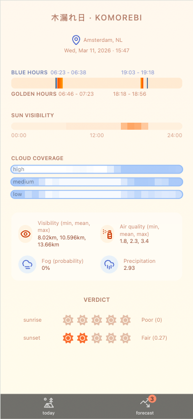

# Komorebi

#### what is Komorebi

Komorebi is a tiny golden hour scoring- and forecasting app based on your current location and weather forecast.



This project was generated using [Angular CLI](https://github.com/angular/angular-cli) version 21.2.1.

### Time spent
| date                    | spent                                                                            |
|-------------------------|----------------------------------------------------------------------------------|
| mon 09-03 20:00 - 21:00 | 1h scaffold, npm install deps, copy AI config                                    |
| mon 09-03 21:00 - 23:00 | 2h skeleton pages, implement figma make UI                                       |
| mon 09-03 23:00 - 24:00 | 1h scaffold services and location implementation                                 |
| tue 10-03 15:30 - 16:00 | 30m golden hour service                                                          |
| tue 10-03 17:00 - 19:00 | 2h caching service, golden hour service, weather service                         |
| tue 10-03 19:00 - 22:00 | 3h ?                                                                             |
| tue 10-03 22:00 - 22:45 | 45m implement weather service and update facade                                  |
| wed 11-03 14:15 - 15:15 | 1h tweaking verdict                                                              |
| wed 11-03 15:15 - 15:45 | 30m revert scoring for AQ and VIZ, cleanup, elaborate unit-tests                 |
| wed 11-03 15:45 - 17:15 | 1h30m setup eslint, copy over gh pipeline, fix lint issues, elaborate unit-tests |

total time spent: mon 4h + tue 6h15m + wed 3h = 13h15m

### issues reported

* Taiga-UI TabBar demo issue: https://github.com/taiga-family/taiga-ui/issues/13449

## Development server

To start a local development server, run:

```bash
ng serve
```

Once the server is running, open your browser and navigate to `http://localhost:4200/`. The application will automatically reload whenever you modify any of the source files.

## Code scaffolding

Angular CLI includes powerful code scaffolding tools. To generate a new component, run:

```bash
ng generate component component-name
```

For a complete list of available schematics (such as `components`, `directives`, or `pipes`), run:

```bash
ng generate --help
```

## Building

To build the project run:

```bash
ng build
```

This will compile your project and store the build artifacts in the `dist/` directory. By default, the production build optimizes your application for performance and speed.

## Running unit tests

To execute unit tests with the [Vitest](https://vitest.dev/) test runner, use the following command:

```bash
ng test
```

## Running end-to-end tests

For end-to-end (e2e) testing, run:

```bash
ng e2e
```

Angular CLI does not come with an end-to-end testing framework by default. You can choose one that suits your needs.

## Additional Resources

For more information on using the Angular CLI, including detailed command references, visit the [Angular CLI Overview and Command Reference](https://angular.dev/tools/cli) page.
